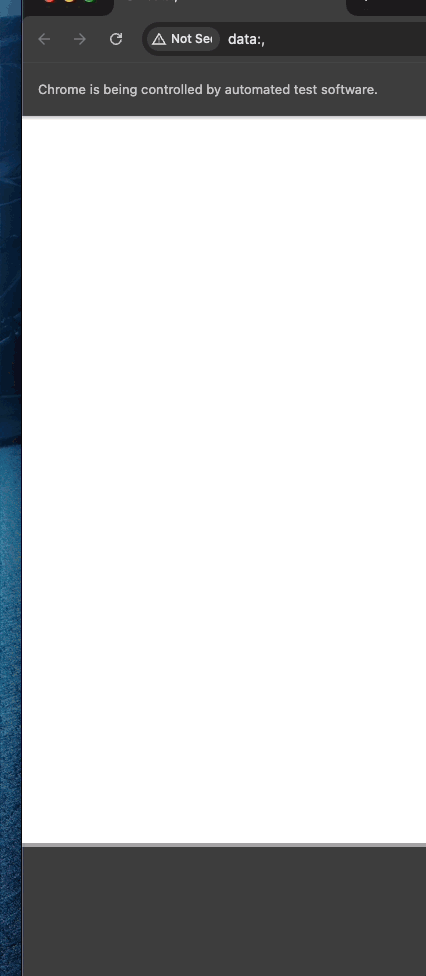

# WAP Tests

## Introduction

This repository contains UI tests for WAP Testing.

### Structure

The system uses a page object model style format to store elements and interactions within each page. All actions should be defined within pages and not be written within thge tests folder to keep the tests maintainable and readable.

The actions in each page use the robot pattern that allows test cases to join operation via the (.) operator.
Each method inside the page should default to returning self in order to maintain this patter.

Pytest is the test runner for this framework. Whenever possible, create a pytest fixture to set up test appropriate and not to bloat test cases.

TWITCH-WAP-TESTS ├── config │ └── Data.py ├── pages │ ├── common.py │ └── twitch_page.py ├── screenshots │ └── TWITCH_TEST_RUN.gif ├── tests │ └── test_twitch.py ├── .env ├── .gitignore ├── conftest.py └── requirements.txt

### Directory and File Descriptions

#### config/Data.py
This directory contains configuration files for the tests. Incudes Data.py which holds constants and data used in the test cases.

#### pages/common.py and twitch_page.py
This directory folllows Page Pbject Model pattern. There is a common.py that contains all common and basic methods that can be shared accross different pages. The specific pages like "twitch_page.py" is tailored to include xpaths and methods specific to a page being tested.

#### screenshots/
This directory will include all test artifacts such as screenshots and recordings.

#### tests/
This is where the test python files resides with test cases specific to a feature. It is also recommended to group test scripts within tests folder on a feature level and implement test suites. The scripts here utilizes and calls page objects, configurations and data that are contained in the other directories.

#### .env
This is a file that is intended to reside only locally , which as expected will be included on the gitignore file. This will indclude all test data that will be called by Data.py.

#### .gitignore
Specified files and directories that should be ignored by Git.

#### requirements.txt
Lists the Python packages and their versions required to run the tests, ensuring that dependencies are managed consistently.

To run a test, do the following:

1. Create a .env file with all required variabled from .config/data.py
2. Install all libraries from requirements.txt
    pip install -r requirements.txt 
3. To run a test:
    pytest tests/{filename}.py

### TWITCH TEST CASE LOCAL SIMULATION

